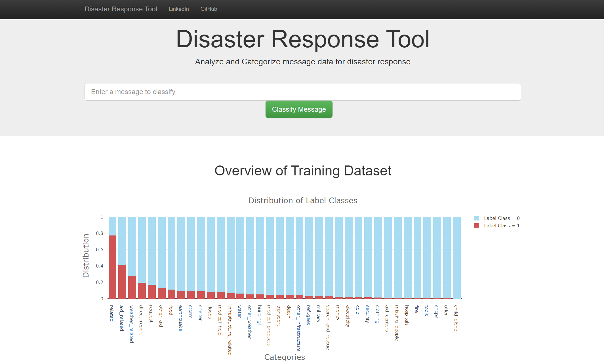

# **Disaster Response Categorisation Tool**

## **Overview**

This web based application was developed as part of a Udacity programme project portfolio. The application takes user inputs in the form of text based messages and highlights relevant disaster response categories out of a total of 36. Additionally, the application also provides visualisations of the dataset the algorithm has been trained on.

An example of a message and the application's categorisations can be seen in the screenshot below:

## **Quick Start**

### **(A) To launch the application follow the steps below:**

1. Launch your terminal and change your working directory path to the "app" folder
2. Run the command "python run.py"
3. Open a browser and type the address http://0.0.0.0:3001/ or try http://localhost:3001

### **(B) Enhanced Functionality**

The application also allows for re-training of the machine learning model. In order to use this functionality, use the full execution steps in the order below:

1. Run the ETL pipeline by running the following command in a terminal (within the root directory of this project):
   * Python data/process_data.py data/disaster_messages.csv data/disaster_categories.csv data/DisasterResponse.db
   * Please note that new datasets for disaster messages and categories can be provided if required. However, these
   should be in the exact same format as the existing disaster_messages and disaster_categories csv files. Additionally, if the new data files are named differently then these need to be provided in step (a) to the script.
   * The DisasterResponse.db is the name of the database the processed pipeline data will be saved to. This can be named as per the users' requirements, but will need to be provided as an input into model script "train_classifier.py"

2. Run the Machine Learning pipeline that trains the classifier and saves the trained model as a pickle file for it to then be used by the web application. To execute the command, run the following in top-level project directory:
 * python models/train_classifier.py data/DisasterResponse.db
 * Please note, as stated in point one the second argument should match the database name you have specified in the ETL pipeline

## **Dependencies & Installations**

The application has been developed primarily in Python v 3.6.3, using the Flask framework. The application has external package dependecies which can be seen below. These need to be installed before running the scripts:

* NumPy 1.12.1
* Pandas 0.23.3
* Matplotlib 2.1.0
* Json
* Plotly 2.0.15
* Nltk 3.2.5
* Flask 0.12.5
* Sklearn 0.19.1
* Sqlalchemy 1.2.19
* Sys
* Re
* Pickle

## **Description of Files**

Folder           | File                   | Description
-----------------|----------------------- |-------------------------------------------
/app/templates   | go.html                | HTML file to render classification results
/app/templates   | master.html            | HTML file for for the index page
/app             | run.py                 | Python file to execute the main web application
/data            | process_data.py        | Python file contain the ETL pipeline
/data  | DisasterResponse.db    | Database containing output of the ETL pipeline
/data            | disaster_categories.csv| csv file containing disaster message categories
/data          | disaster_messages.csv  | csv file containing disaster message text
/models          | classifier.pkl         | Trained model used by the web application to classify messages
/models          | train_classifier.py    | Python file containing the full ML pipeline

## **Acknowledgement**

This application utilises third-party open-source frameworks such as the packages mentioned in _**dependencies & installations**_. Additionally, the templates for the front-end were provided by Udacity and are based on Bootstrap. Finally, the training data has been sourced by Udacity from Figure eight

## **License**
This app was completed by Hammad Riaz (hammadriaz_@hotmail.com) as part of the Udacity Programme Portfolio with the data contributed from Figure Eight.      